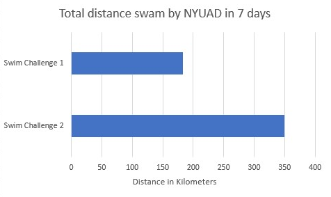
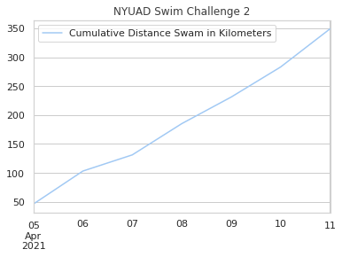
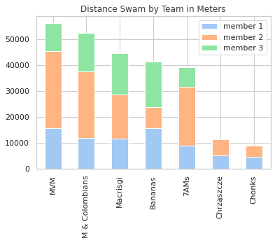

# NYUAD Swim Challenge Leaderboard  
April 5 - 11, 2021  

Updated: 
12/04/2021 13:10

## Distance swam in total: 349 kilometers 

  

Participants in total: 39  

## Team Ranking  
if you win team prize, you cannot win individual prize
| team                                           |   distance |
|:-----------------------------------------------|-----------:|
| MVM                                            |      56100 |
| Maya and the Colombians                        |      52300 |
| Macrisgi                                       |      44600 |
| Bananas                                        |      41350 |
| Who Took All The 7 AM sessions?                |      39250 |
| Chrząszcze z Chrzęszyżeworzyc, powiat Łękołowy |      11300 |
| Swimming chonks                                |       8700 |

  

## Individual Ranking  
|    |   distance | first_name                      |   total_sessions | swim_session_dates                |
|---:|-----------:|:--------------------------------|-----------------:|:----------------------------------|
|  1 |      30000 | Marko B                         |               11 | 05-06-06-07-07-08-09-10-10-11-11- |
|  2 |      28900 | Mauricio L                      |                8 | 05-06-08-08-09-10-11-11-          |
|  3 |      25700 | Maya B                          |                9 | 06-07-08-08-09-10-11-11-11-       |
|  4 |      22800 | Hannah G                        |               10 | 05-06-08-09-09-10-10-11-11-11-    |
|  5 |      17600 | Vegan Shark 25                  |                7 | 05-06-08-09-10-11-11-             |
|  6 |      17000 | Giovanna M                      |                9 | 05-06-07-08-09-10-10-11-11-       |
|  7 |      15950 | Mauricio  Y                     |                7 | 05-06-07-08-09-10-11-             |
|  8 |      15550 | Baby Shark 3                    |                5 | 06-08-09-10-11-                   |
|  9 |      15500 | María José  A                   |                5 | 05-06-07-09-10-                   |
| 10 |      14700 | Falcon with Fins 20             |                6 | 05-08-09-10-11-11-                |
| 11 |      11900 | Nemo looking for their major 10 |                6 | 06-08-09-10-11-11-                |
| 12 |      11650 | Cristian G                      |                6 | 05-06-08-09-10-11-                |
| 13 |      10600 | Vale J                          |                4 | 05-06-07-09-                      |
| 14 |       9400 | Shubhan B                       |                6 | 05-06-06-07-07-08-                |
| 15 |       8800 | Daniel D                        |                4 | 08-09-10-11-                      |
| 16 |       8200 | Vegan Shark 9                   |                5 | 05-08-09-10-11-                   |
| 17 |       7900 | Doplhin on a Study Away 4       |                5 | 05-06-10-11-11-                   |
| 18 |       7650 | Sebastian K                     |                6 | 05-06-07-08-09-10-                |
| 19 |       7640 | Jeremy T                        |                4 | 05-06-08-10-                      |
| 20 |       7500 | Balázs S                        |                4 | 05-06-07-08-                      |
| 21 |       6300 | Little Penguin 13               |                3 | 06-07-09-                         |
| 22 |       5900 | Everett  P                      |                2 | 08-10-                            |
| 23 |       5400 | PJ H                            |                3 | 06-08-11-                         |
| 24 |       5000 | Vegan Shark 11                  |                4 | 05-06-07-09-                      |
| 25 |       4500 | Domnica  D                      |                3 | 05-06-08-                         |
| 26 |       4200 | Brave Turtle 16                 |                2 | 06-09-                            |
| 27 |       2900 | Antonina B                      |                1 | 05-                               |
| 28 |       2800 | Jiayun S                        |                2 | 05-06-                            |
| 29 |       2500 | Turbo Gazelle 20                |                1 | 06-                               |
| 30 |       2100 | Sebastiano Pio M                |                1 | 05-                               |
| 31 |       2000 | Nemo looking for their major 19 |                2 | 05-10-                            |
| 32 |       1800 | Falcon with Fins 14             |                1 | 08-                               |
| 33 |       1700 | Turbo Gazelle 23                |                1 | 08-                               |
| 34 |       1700 | Commited Clownfish 25           |                1 | 05-                               |
| 35 |       1500 | Brave Turtle 12                 |                1 | 05-                               |
| 36 |       1500 | Little Penguin 8                |                1 | 09-                               |
| 37 |       1000 | Zhong Chen T                    |                1 | 10-                               |
| 38 |        500 | Xander C                        |                1 | 06-                               |
| 39 |        450 | Commited Clownfish 1            |                1 | 06-                               |
## Teams registered  
|                                                | 0        | 1        | 2         |
|:-----------------------------------------------|:---------|:---------|:----------|
| Bananas                                        | Ivana    | Charlie  | Jenn      |
| Macrisgi                                       | Giovanna | Mauricio | Cristian  |
| MVM                                            | Maria    | Vale     | Marko     |
| Chrząszcze z Chrzęszyżeworzyc, powiat Łękołowy | Marta    | Kacper   | Iwo       |
| Maya and the Colombians                        | Maya     | Tomas    | Juan      |
| Swimming chonks                                | Domnica  | Pranaav  | undefined |
| Who Took All The 7 AM sessions?                | Hannah   | Daniel   | Sebastian |
